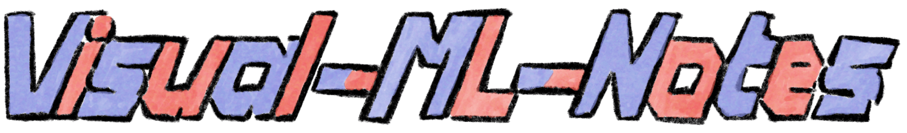
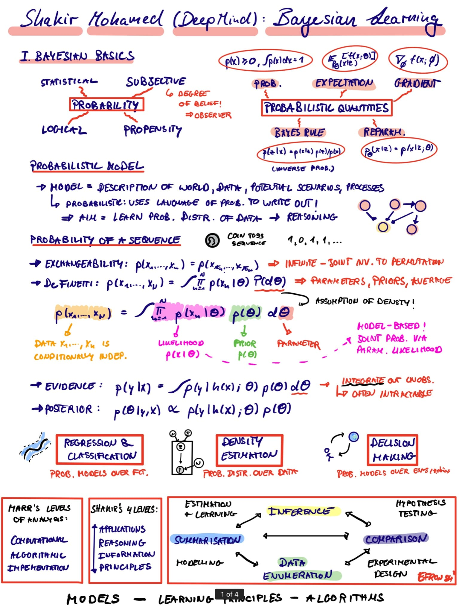

# A Collection of Conference & School Notes in Machine Learning

In this repo I collect my visual conference & summer school sketch notes - to prevent things getting messy. Feel free to have a look and enjoy, [@RobertTLange](https://twitter.com/RobertTLange)!

## FAQs

* Q: **What tablet do you use?**
A: I use an iPad 12.9' with the new Apple Pencil. But you don't have to. There are many cheaper tablet which do the job and I have seen awesome handwritten notes.

* Q: **What apps do you use?**
A: I use notability for all the talk sketches and procreate for illustrations. But I have also heard many good things about GoodNotes. Have a look at my [recent blogpost](https://roberttlange.github.io/posts/2020/04/blog-post-11/) in which I discuss my personal Machine Learning Research-iPad setup.

* Q: **Any advice on how to take notes?**
A: Ask yourself what type of notes you are would like to come back to in a week, month, or year. Also have a look at [Natalia Vélez](https://twitter.com/natvelali). Her sketches are awesome! And practice on talks by great speakers. A well structured talk is way easier to summarise.

* Q: **Is there a gallery of all your notes?**
A: Yes, there is! Check out the Web UI [visual-ml-notes](https://visual-ml-notes.github.io/).

| Date | Name   |  Type   | Location |  Notes  |  Program  |
| :----: |:----------:| :------:| :-----:| :----:| :----:|
20-07 | MLSS | Summer School | Virtual | [Click](2020-07-MLSS/) | [Click](2020-07-MLSS/Program-MLSS-a.png)
20-04 | ICLR | Conference | Virtual | [Click](2020-04-ICLR/ICLR_compressed.pdf) | [Click](2020-04-ICLR/Program-ICLR.pdf)
19-12 | NeuRIPS | Conference | Vancouver (Canada) | [Click](2019-12-NeuRIPS/) | [Click](2019-12-NeuRIPS/Program-NeuRIPS.pdf)
19-09 | Bernstein | Conference | Berlin (Germany) | [Click](2019-09-Bernstein/) | [Click](2019-09-Bernstein/Program-1-Bernstein.png)
19-09 | CCN | Conference | Berlin (Germany) | [Click](2019-09-CCN/) | [Click](2019-09-CCN/Program-1-CCN.png)
19-08 | BMS | Summer School | Berlin (Germany) | [Click](2019-08-BMS/) | [Click](2019-08-BMS/Program-BMS.png)
19-07 | EEML | Summer School | Bucharest (Romania) | [Click](2019-07-EEML/) | [Click](2019-07-EEML/Program-EEML.png)
19-06 | RAAI | Conference | Bucharest (Romania) | [Click](2019-06-RAAI/) | [Click](2019-06-RAAI/Program-1-RAAI.png)
19-06 | FENS ENCODS | PhD Symposium | London (UK) | [Click](2019-06-FENS-ENCODS/) | [Click](2019-06-FENS-ENCODS/Program-1-FENS-ENCODS.png)
18-12 | NeuRIPS | Conference | Montreal (Canada) | [Click](2018-12-NeuRIPS/) | [Click](https://nips.cc/Conferences/2018)
18-07 | FENS Forum | Conference | Berlin (Germany) | [Click](2018-07-FENS-Forum/) | [Click](2018-07-FENS-Forum/Program-1-FENS-ENCODS.png)
17-08 | ESSIR | Summer School | Barcelona (Spain) | [Click](2017-09-ESSIR/) | [Click](2017-09-ESSIR/Program-1-ESSIR.png)
17-08 | DS^3 | Summer School | Paris (France) | [Click](2017-08-DS^3/) | [Click](2017-08-DS^3/Program-DS^3.png)
